<h1 align="center"> ChallengeJava</h1>
<h2 align="center">Projeto de menu com cadastro, Login e realização de compras 🛒</h2>
<h4 align="center">
	🚧   Concluído 🚀 🚧
</h4>
<p align="center">
 <a href="#objetivo">Objetivo</a> •
 <a href="#funcionalidades">Funcionalidades</a> • 
 <a href="#executar">Como executar</a>• 
 <a href="#desenvolvedores">Desenvolvedores</a>
</p>
<h2 id="objetivo">💻 Sobre o projeto</h2>
O projeto foi desenvolvido com o propósito de criar um menu que facilita as compras e o cadastro do usuário. Os usuários podem explorar informações detalhadas sobre produtos, realizar cadastros e finalizar compras, com todos os dados salvos em seus perfis. </br>
Este projeto faz parte da segunda Sprint do Challenge da Salesforce, fornecido pela instituição FIAP.
 <h2 id="funcionalidades">⚙️ Funcionalidades</h2>

 - **Menu principal**
 - [x] Criar um cadastro
 - [x] Listar todos os cadastros
 - [x] Fazer Login
 - [x] Visualizar produtos comprados
 - **Menu de compras**
- [x] Apresentar carecterísticas dos produtos
- [x] Adicionar produtos ao carrinho
- [x] Mostrar produtos que estão no carrinho e apresentar valor total
- [x] Finalizar compra
- [x] Limpar carrinho
- [x] Sair do menu

<h2 id="executar">⚒️Como executar e usar o progrma</h2>
<h3>pré-requisitos</h3>
Antes de começar, você precisa ter instalado em sua máquina o GIT. Além disso você também precisa ter instalado algum programa que execute códigos em Java, como o Intellig, Eclipse, NetBeans, entre outros.
<h3>Como executar</h3>
<p>1. Clone o projeto em sua máquina utilizando o comando `git clone` no terminal.<br/>
2. Abra a pasta do projeto no seu ambiente de desenvolvimento.<br/>
3. Execute a classe `Main` para iniciar o programa.<br/>
Após isso aparecerá o menu com as seguintes opções:</p>
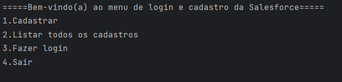<p>
Podemos criar um cadastro selecionando a opção 1. Para criar o cadastro o programa irá pedir as seguintes informações: </p>
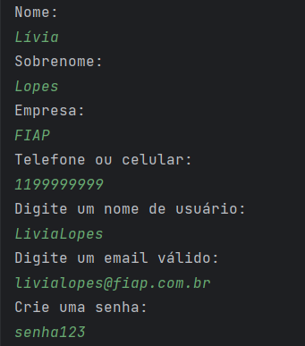

<p>Criamos uma ArrayList de Logins para realizar o armazenamento dos cadastros</p>

```java
        var logins = new ArrayList<Login>();        
  ```
<p>E quando selecionamos a opção 1, o programa adiciona o login cadastrado nesta ArrayList, utilizando o método criarLogin que retorna um Login </p>

```java
        if (opcao == 1) {
          logins.add(criarLogin(logins));
        }
  ```

<p>Não podemos utilizar o mesmo nome de usuário e email para realizar outro cadastro, eles devem ser unicos!</p>
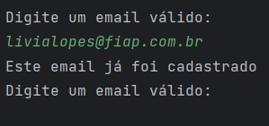
<p>Após criar um cadastro, o programa volta para o menu principal. Onde podemos selecionar a segunda opção que irá listar todos os cadastros</p>
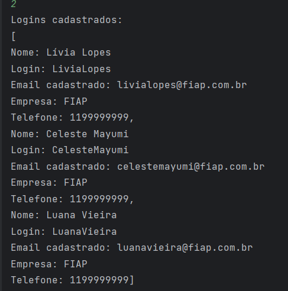
<p>Utilizamos o seguinte código para realizar a listagem dos cadastros:</p>

```java
       else if (opcao == 2) {
                //Mostra no Console os Logins cadastrados
                if(!logins.isEmpty()) {
                    System.out.println("Logins cadastrados:\n" + logins);
                }
                //Se não houver nenhum cadastro
                else {
                    System.out.println("Nenhum cadastro foi realizado");
                }
            }
  ```
<p>Na opção 3 do menu, você pode realizar o login. Nele você precisa informar o nome de usuário ou email cadastrado e depois inserir sua senha. Caso alguma informação esteja incorreta, você não conseguirá realizar o login  </p>
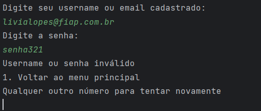
<p>se você inserir as informações corretas, irá aparecer o seguinte menu: </p>
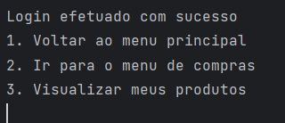
<p>Na opção 2 você será redirecionado ao menu de compras da Salesforce, onde irá poder adquirir produtos</p>

<p>Se selecionarmos a opção 1, o programa irá apresentar os produtos para o usuário</p>
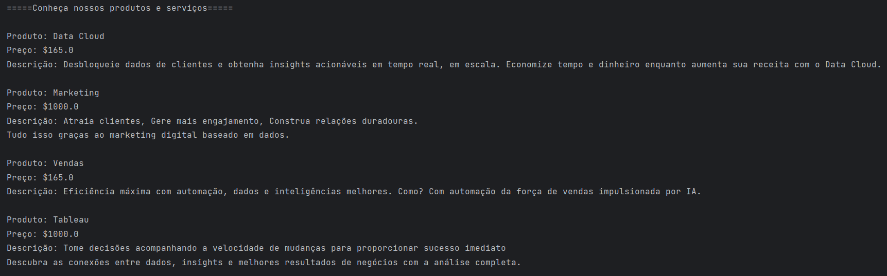
<p>Depois ele retorna ao menu principal. <br/>Na segunda opção o programa irá abrir outro menu para escolhermos os produtos que desejamos adicionar ao carrinho</p>
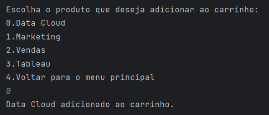
<p>Quando o usuário retornar para o menu principal, ele poderá ver seu carrinho de compras selecionando a opção 3. Nesta opção o programa também informa o valor total dos produtos e você tem a opção de finalizar a compra.</p>
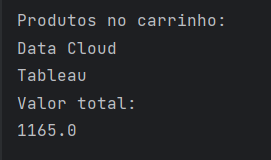
<p>Na opção 4, o programa irá limpar seu carrinho, deixando ele vazio</p>
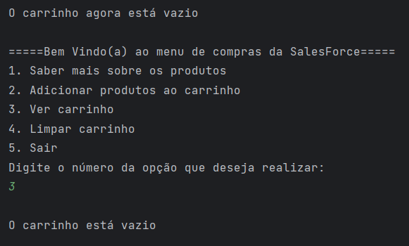
<p>Se digitarmos a opção 3, após limpar o carrinho, ele informará que o carrinho está vazio.</p>
<p>Por fim se digitarmos a opção 5 retornaremos ao menu de Login, mas para realizar a compra precisamos selecionar a opção 3 e depois finalizar a compra </p>
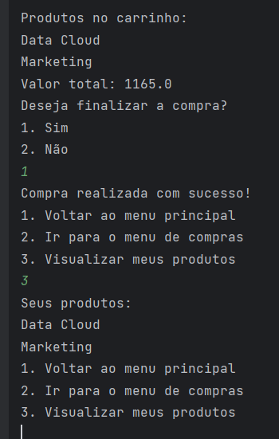
<p>Após isso o programa retorna ao menu do login. Onde podemos visualizar os produtos adquiridos utilizando a opção 3</p>

<p>Por fim, podemos encerrar o programa digitando a opção 1 para retornar ao menu principal e depois a opção 4 para sair.</p>
<h2 id="desenvolvedores">👩‍💻Desenvolvedores</h2>

<table>
  <tr>
    <td align="center"><br /><sub><b>Celeste Mayumi</b></sub><br /><a href="https://www.linkedin.com/in/celestetanaka/" title= "Linkedin"></a><a href="https://github.com/celestemayumi" title="GitHub"></a></td>  
    <td align="center"><br /><sub><b>Lívia Lopes</b></sub><br /><a href="https://www.linkedin.com/in/liviamarianalopes/" title="Linkedin"></a><a href="https://github.com/LiviaMarianaLopes" title="GitHub"></a></td>
    <td align="center"><br /><sub><b>Luana Vieira</b></sub><br /><a href="https://www.linkedin.com/in/luana-vieira-a093b5289/" title="Linkedin"></a><a href="https://github.com/luacttau" title="GitHub"></a></td>
   
  </tr>
</table>


